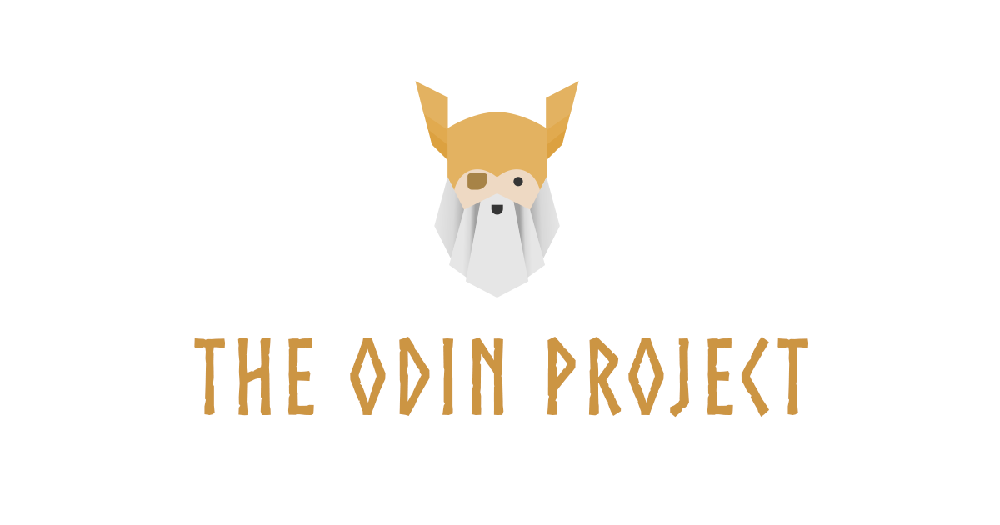
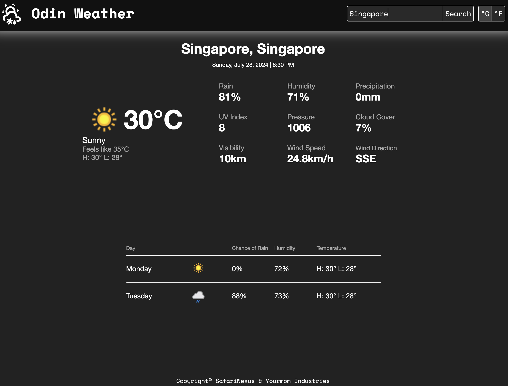
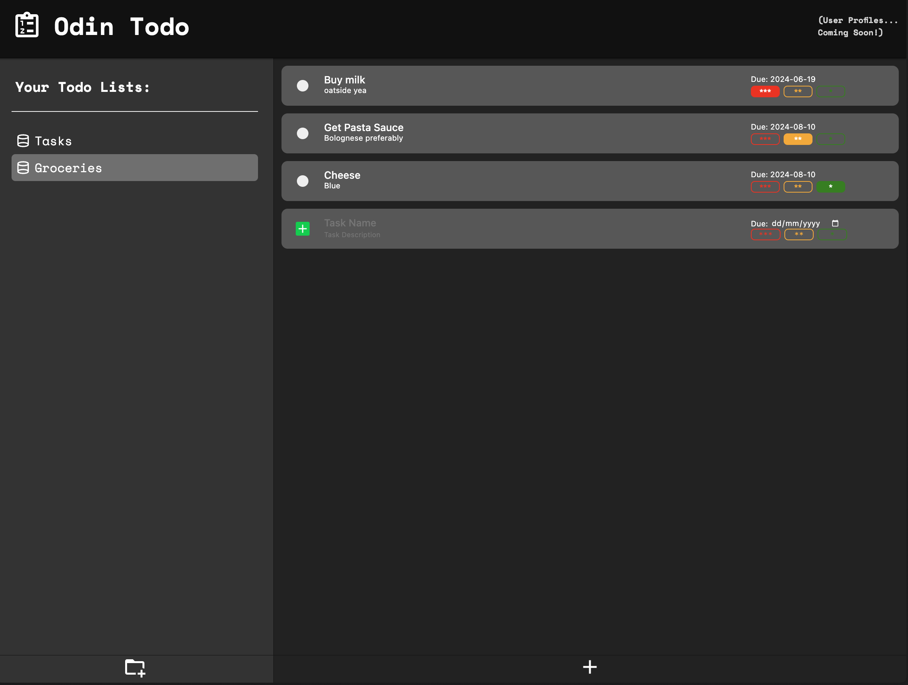
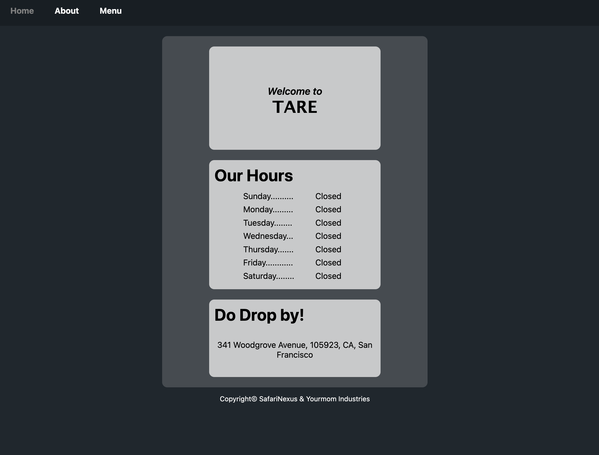
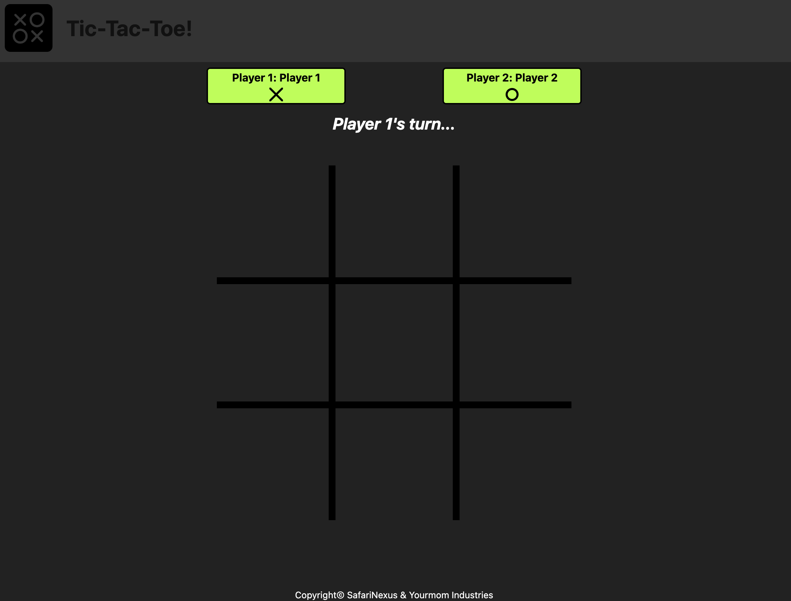
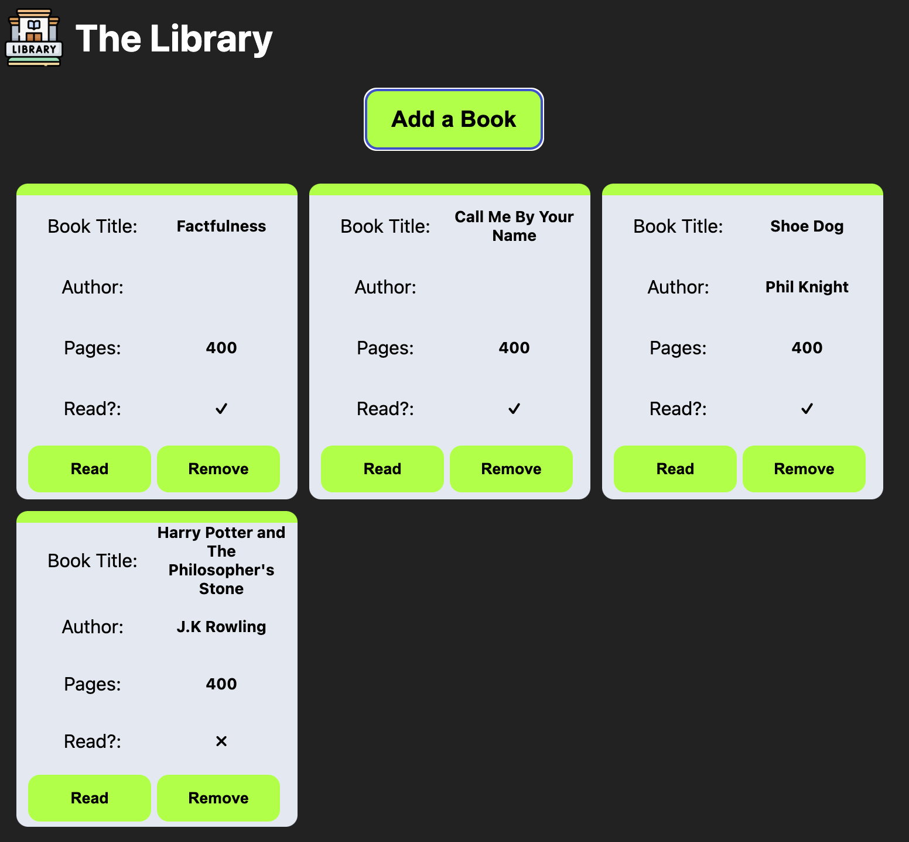

# odin_projects

"The Odin Project" projects by me, Edgar @safarinexus. Meant to demonstrating undergoing and completion of "The Odin Project" in full, as well as display fullstack web development skills learnt. 

## Getting Started

These instructions will get you into my projects, understand their context and how to enjoy and admire them.

### Prerequisites

No substantial software required, just a modern-browser will suffice.

### Installing

No installation needed. Just click on links provided and open them up in a browser of your choice.

### Path 

The Odin Project provides two paths for aspiring developers to go down, Full Stack Ruby on Rails path or Full Stack JavaScript (Node.js) Path. I chose the Node.js path, for more relevancy and interest.

## Projects (& Links to projects)

### Odin Weather App  

Intermediate JavaScript API Project  
Project: Weather App  

### Odin Todo List  

Intermediate JavaScript Project  
Project: Todo List 
  
  
### Odin Restaurant Page  

Intermediate JavaScript Webpack Project 
Project: Restaurant Page  

### Odin Tic-Tac-Toe  

Intermediate JavaScript IIFE & Factory Functions Project 
Project: Tic-Tac-Toe  

### Odin Calculator  

JavaScript Basics Final Project 
Project: Calculator

### Odin Library  

Intermediate JavaScript & JS Objects Project 
Project: Library  

### Odin Dashboard  

Intermediate HTML & CSS Grid Project  
Project: Admin Dashboard  

### Odin Sign-up Form  

Intermediate HTML & CSS Form Project 
Project: Sign-up Form  

### Odin Etch-a-Sketch  

JavaScript Basics DOM Manipulation Project  
Project: Etch-a-Sketch  

### Odin Rock Paper Scissors  

JavaScript Basics Project  
Project: Rock Paper Scissors  

### Odin Landing Page  

CSS & Flexbox Foundations Project  
Project: Landing Page   

### Odin Recipes  

HTML Foundations Project  
Project: Recipes  

<h1></h1>
  
13. Odin Battleship   
Intermediate JavaScript Project  
Project: Battleship  
The final project for JavaScript, the game of Battleship.   
  
14. Odin Homepage  
Advanced HTML & CSS Project  
Project: Homepage  
A CV homepage meant to practice advanced HTML & CSS skills.  
  
15. Odin React CV Maker Application  
React Project  
Project: CV Application  
My first ever React project, an application that helps build a CV/Resume  
  
16. Odin React Memory Card  
React Project  
Project: Memory Card  
The game of memory cards, made with React, right in the browser.  
  
17. Odin React Shop Site  
React Project  
Project: Shopping Cart  
A frontend UI for a shopping page, built with React.  
  
18. Odin Node Basic Informational Site   
Node Project   
Project: Basic Informational Site   
A simple backend for an informational site.  
  
19. Odin Node Express Mini Message Board  
Node Express Project  
Project: Mini Message Board  
A simple mini message board website with a backend using MVC Pattern and Express.js.  
  
20. Odin Node Express PostgreSQL Inventory Application   
Node Express PostgreSQL Project   
Project: Inventory Application   
A website showcasing a collection of games implemented with PostgreSQL database.  

21. Odin Node Express PassportJS Members Only  
Node Express PassportJS Project  
Project: Members Only  
Members only website with differing privileges for different user levels, authenticated using Passport.js.  
  
22. Odin Node Express Prisma File Uploader  
Node Express Prisma Project  
Project: File Uploader  
A Google Drive clone where authenticated users can CRUD files and folders for those files.  
  
23. Odin Node Express RESTful API Blog API  
Node Express REST API Project  
Project: Blog API  
A RESTful API Backend for a Blog with endpoints connected to two frontends, one to author blogs and one to view them.  

## Technologies Learnt & Used

* [JavaScript](https://developer.mozilla.org/en-US/docs/Web/JavaScript)
* [React](https://react.dev/)
* [Node.js](https://nodejs.org/en)
* [Express.js](https://expressjs.com/)
* [RESTful API](https://en.wikipedia.org/wiki/REST)
* [PostgreSQL](https://www.postgresql.org/)
* [Prisma](https://www.prisma.io/)
* [Git](https://git-scm.com/)
* [HTML5](https://developer.mozilla.org/en-US/docs/Web/HTML)
* [CSS3](https://developer.mozilla.org/en-US/docs/Web/CSS)
* [Webpack](https://webpack.js.org/)
* [npm](https://www.npmjs.com/)
* [JSON](https://www.json.org/)
* [Jest](https://jestjs.io/)
* [A11y](https://www.a11yproject.com/)
* [Vite](https://vitejs.dev/)
* [Vercel](https://vercel.com/)
* [Koyeb](https://app.koyeb.com/)
* [TailwindCSS](https://tailwindcss.com/) - Outside Syllabus, Self-learnt
* [TypeScript](https://www.typescriptlang.org/) - Outside Syllabus, Self-learnt 

## Contributing

Please read [CONTRIBUTING.md](https://gist.github.com/PurpleBooth/b24679402957c63ec426) for details on our code of conduct, and the process for submitting pull requests to us.

## Authors

* **Edgar Teong**(me!) - [SafariNexus](https://github.com/safarinexus)

## License

This project is licensed under the MIT License - see the [LICENSE.md](LICENSE.md) file for details

## Acknowledgments

* Authors, Contributors & Maintainers of [The Odin Project](https://github.com/TheOdinProject)
  
