
# [edgr-odinprojects](https://safarinexus.github.io/edgr-odinprojects/)

"The Odin Project" projects by me, Edgar (@safarinexus). Meant to demonstrating undergoing and completion of "The Odin Project" in full, as well as display fullstack web development skills learnt. 

## Getting Started

These instructions will get you into my projects, understand their context and how to enjoy and admire them.

### Prerequisites

No substantial software required, just a modern-browser will suffice.

### Installing

No installation needed. Just click on links provided and open them up in a browser of your choice.

### Navigation 
Click any of the project titles below. Or navigate through the homepage [here](https://safarinexus.github.io/edgr-odinprojects).

### Path 

The Odin Project provides two paths for aspiring developers to go down, Full Stack Ruby on Rails path or Full Stack JavaScript (Node.js) Path. I chose the Node.js path, for more relevancy and interest.

## Projects (& Links to Projects)

*Projects are presented in reverse-order of syllabus.*

### [Odin Node Express RESTful API Blog API Website](https://edgr-odin-blog-access.vercel.app/)
<a href="https://edgr-odin-blog-access.vercel.app/">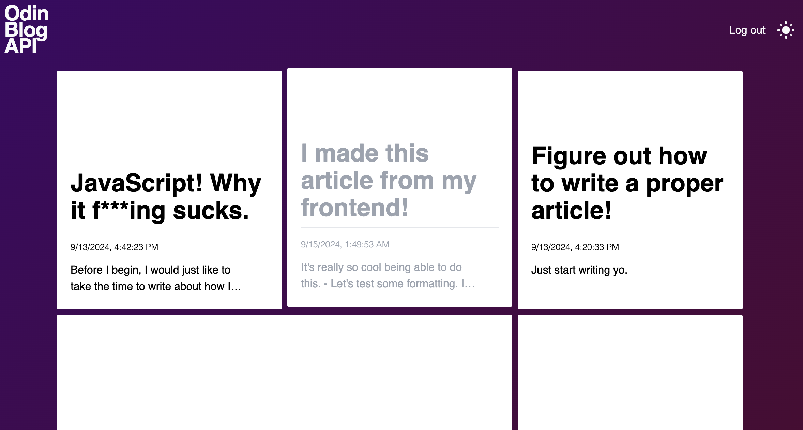</a> 
Node Express REST API Project 
Project: Blog API  

### [Odin Node Express Prisma File Uploader](https://odin-file-uploader-production-11ed.up.railway.app/) 
<a href="https://odin-file-uploader-production-11ed.up.railway.app/">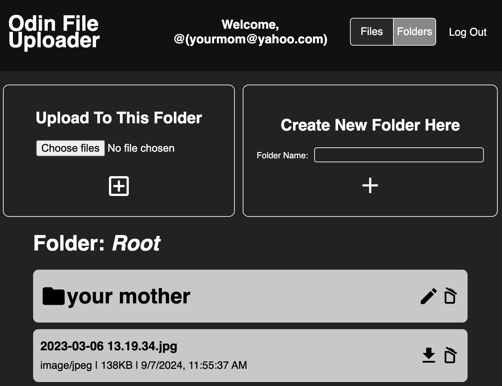</a> 
Node Express Prisma Project 
Project: File Uploader
  
### [Odin Node Express PassportJS Members Only](https://odin-membersonly-production.up.railway.app/)
<a href="https://odin-membersonly-production.up.railway.app/">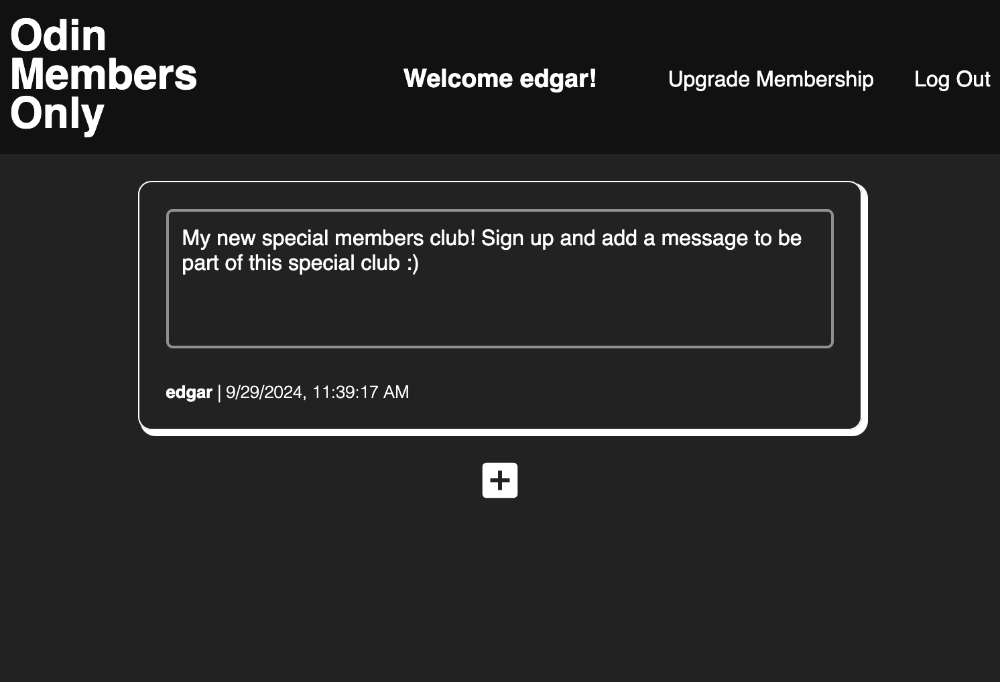</a>  
Node Express PassportJS Project 
Project: Members Only
  
### [Odin Node Express PostgreSQL Inventory Application](https://edgrodinprojects-production.up.railway.app/)
<a href="https://edgrodinprojects-production.up.railway.app/">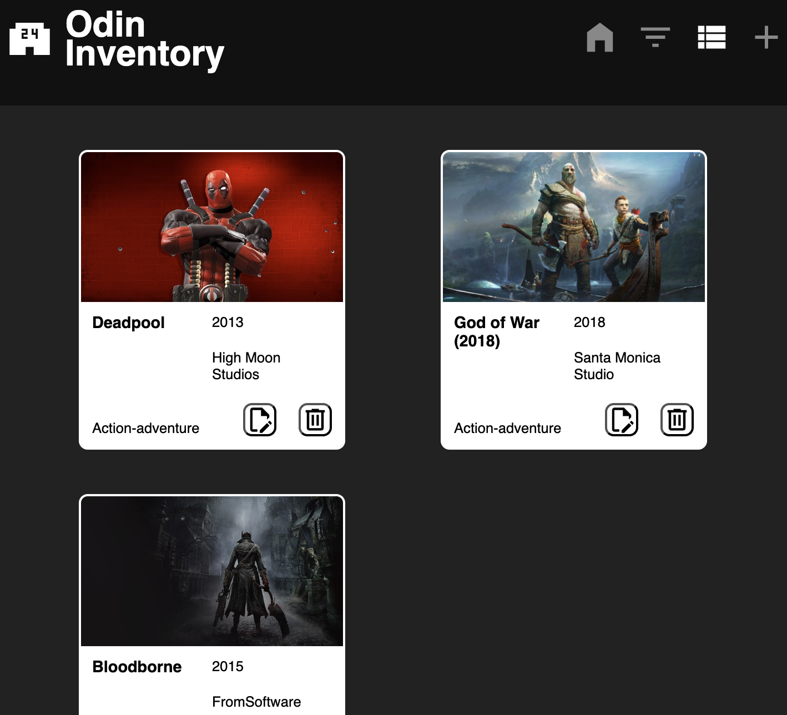</a> 
Node Express PostgreSQL Project 
Project: Inventory Application

### [Odin Node Express Mini Message Board](https://overseas-phoebe-safarinexus-e4f74908.koyeb.app/)

<a href="https://overseas-phoebe-safarinexus-e4f74908.koyeb.app/">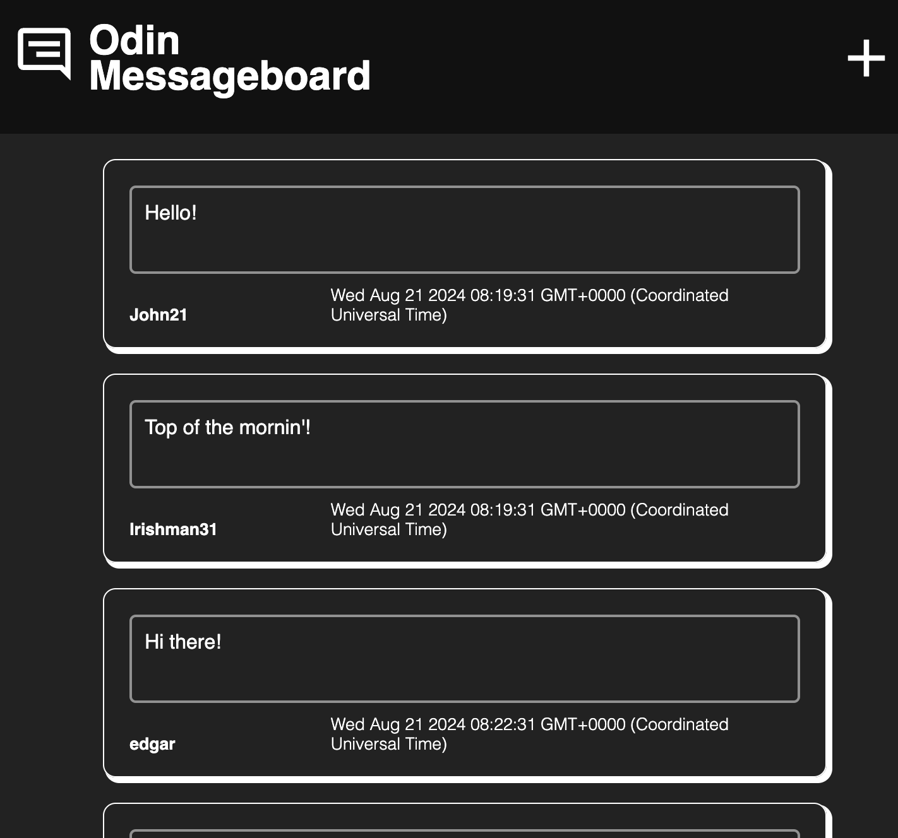</a> 
Node Express MVC Project 
Project: Mini Message Board  

### [Odin Node Basic Informational Site](https://github.com/safarinexus/edgr-odinprojects/tree/main/odin-node-basic)   

Node Project   
Project: Basic Informational Site   

### [Odin Databases SQLZoo](https://github.com/safarinexus/edgr-odinprojects/blob/main/odin-databases-sqlzoo/completion_ss.png)

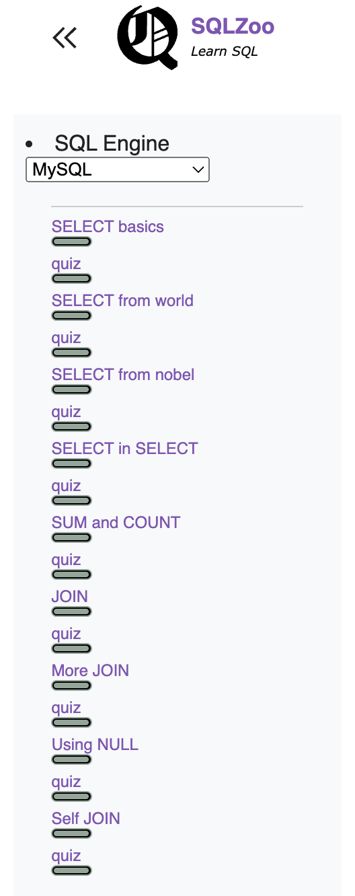  
Databases Project 
Project: SQLZoo

### [Odin React Shopping Site](https://odin-shopping-page.vercel.app/)

<a href="https://odin-shopping-page.vercel.app/">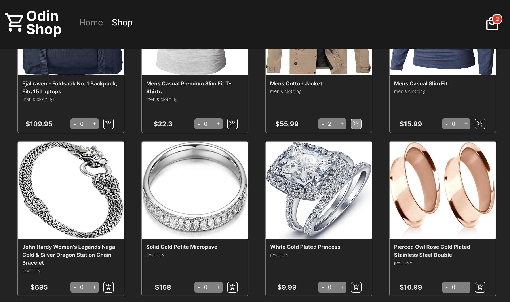</a>  
React Project 
Project: Shopping Cart   

### [Odin React Memory Card](https://odin-projects-nine.vercel.app/) 

<a href="https://odin-projects-nine.vercel.app/">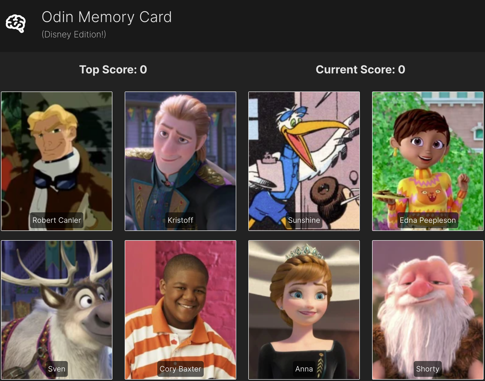</a>  
React Project  
Project: Memory Card  

### [Odin React CV Maker Application](https://odin-projects-psi.vercel.app/)

<a href="https://odin-projects-psi.vercel.app/">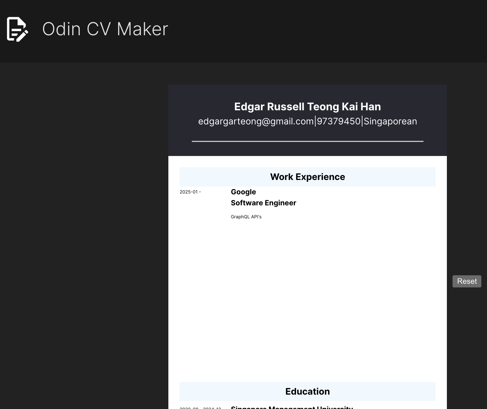</a> 
React Project 
Project: CV Application  

### [Odin Homepage](https://safarinexus.github.io/edgr-odinprojects/odin-homepage/index.html)

<a href="https://safarinexus.github.io/edgr-odinprojects/odin-homepage/index.html">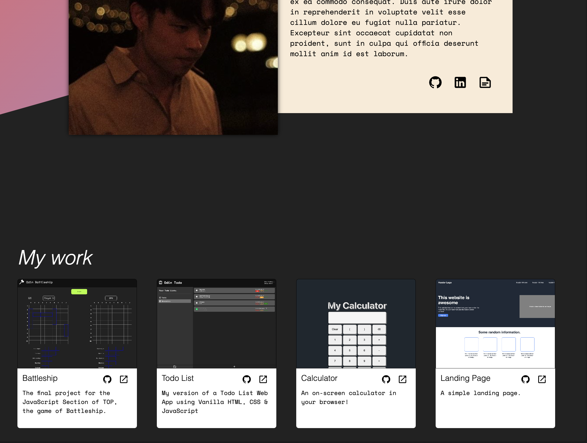</a>  
Advanced HTML & CSS Project 
Project: Homepage  

### [Odin Battleship](https://safarinexus.github.io/edgr-odinprojects/odin-js-battleship/dist/index.html)

<a href="https://safarinexus.github.io/edgr-odinprojects/odin-js-battleship/dist/index.html">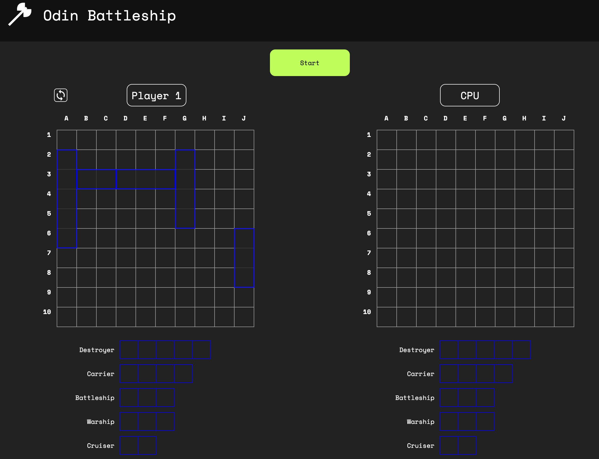</a> 
Intermediate JavaScript Project  
Project: Battleship   

### [Odin Weather App](https://safarinexus.github.io/edgr-odinprojects/odin-js-weatherapp/index.html) 

  
Intermediate JavaScript API Project  
Project: Weather App  

### [Odin Todo List](https://safarinexus.github.io/edgr-odinprojects/odin-js-todo/dist/index.html)

  
Intermediate JavaScript Project  
Project: Todo List 

### [Odin Restaurant Page](https://safarinexus.github.io/edgr-odinprojects/odin-js-restaurantpage/dist/index.html)

  
Intermediate JavaScript Webpack Project 
Project: Restaurant Page  

### [Odin Tic-Tac-Toe](https://safarinexus.github.io/edgr-odinprojects/odin-js-tictactoe/jstictactoe.html)

  
Intermediate JavaScript IIFE & Factory Functions Project 
Project: Tic-Tac-Toe  

### [Odin Library](https://safarinexus.github.io/edgr-odinprojects/odin-js-library/jslibrary.html)

  
Intermediate JavaScript & JS Objects Project 
Project: Library  

### [Odin Dashboard](https://safarinexus.github.io/edgr-odinprojects/odin-dashboard/dashboard.html)  

Intermediate HTML & CSS Grid Project  
Project: Admin Dashboard  

### [Odin Sign-up Form](https://safarinexus.github.io/edgr-odinprojects/odin-signup/signup.html)

Intermediate HTML & CSS Form Project 
Project: Sign-up Form  

### [Odin Calculator](https://safarinexus.github.io/edgr-odinprojects/odin-calculator/calculator.html)  

  
JavaScript Basics Final Project 
Project: Calculator

### [Odin Etch-a-Sketch](https://safarinexus.github.io/edgr-odinprojects/odin-etch-a-sketch/etch-a-sketch.html)

JavaScript Basics DOM Manipulation Project  
Project: Etch-a-Sketch  

### [Odin Rock Paper Scissors](https://safarinexus.github.io/edgr-odinprojects/odin-rockpaperscissors/rockpaperscissors.html)

JavaScript Basics Project  
Project: Rock Paper Scissors  

### [Odin Landing Page](https://safarinexus.github.io/edgr-odinprojects/odin-landing-page/landing-page.html)

CSS & Flexbox Foundations Project  
Project: Landing Page   

### [Odin Recipes](https://safarinexus.github.io/edgr-odinprojects/odin-recipes/recipes.html)

HTML Foundations Project  
Project: Recipes    

## Technologies Learnt & Used

* [JavaScript](https://developer.mozilla.org/en-US/docs/Web/JavaScript)
* [React](https://react.dev/)
* [Node.js](https://nodejs.org/en)
* [Express.js](https://expressjs.com/)
* [RESTful API](https://en.wikipedia.org/wiki/REST)
* [PostgreSQL](https://www.postgresql.org/)
* [Prisma](https://www.prisma.io/)
* [Git](https://git-scm.com/)
* [HTML5](https://developer.mozilla.org/en-US/docs/Web/HTML)
* [CSS3](https://developer.mozilla.org/en-US/docs/Web/CSS)
* [Webpack](https://webpack.js.org/)
* [npm](https://www.npmjs.com/)
* [JSON](https://www.json.org/)
* [Jest](https://jestjs.io/)
* [A11y](https://www.a11yproject.com/)
* [Vite](https://vitejs.dev/)
* [Vercel](https://vercel.com/)
* [Koyeb](https://app.koyeb.com/)
* [TailwindCSS](https://tailwindcss.com/) - Outside Syllabus, Self-learnt
* [TypeScript](https://www.typescriptlang.org/) - Outside Syllabus, Self-learnt 

## Contributing

Please read [CONTRIBUTING.md](https://gist.github.com/PurpleBooth/b24679402957c63ec426) for details on our code of conduct, and the process for submitting pull requests to us.

## Authors

* **Edgar Teong**(me!) - [SafariNexus](https://github.com/safarinexus)

## License

This project is licensed under the MIT License - see the [LICENSE.md](LICENSE.md) file for details

## Acknowledgments

* Authors, Contributors & Maintainers of [The Odin Project](https://github.com/TheOdinProject)
  
