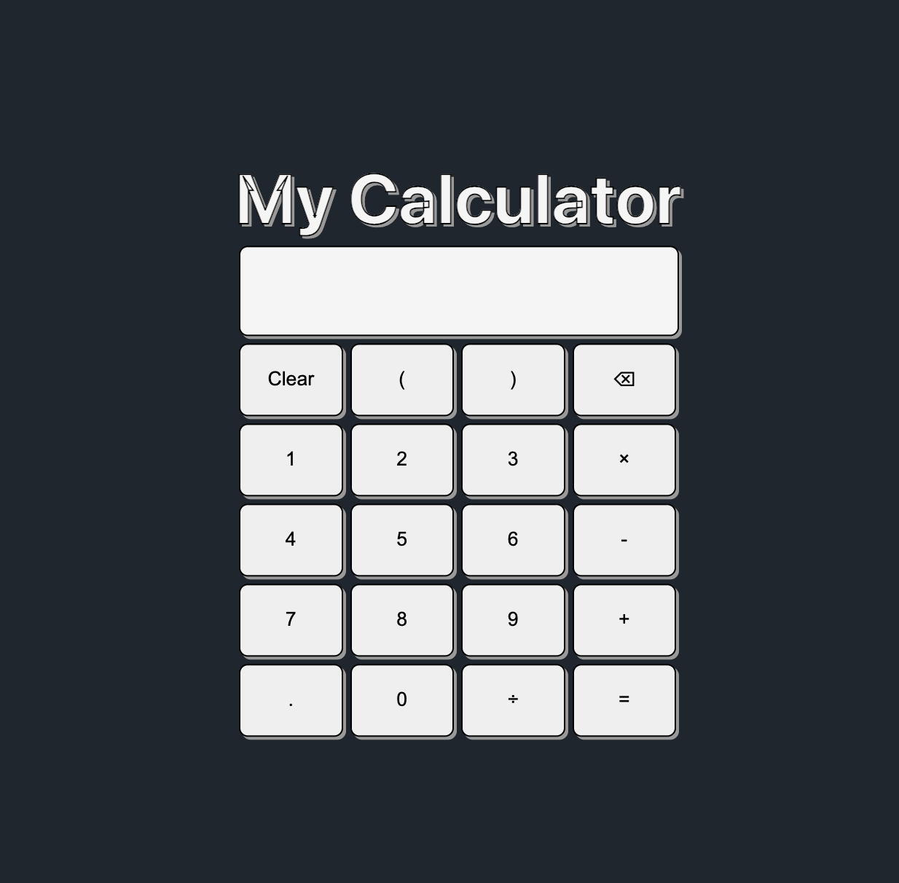

# edgr_odin_projects

"The Odin Project" projects by me, Edgar (@safarinexus). Meant to demonstrating undergoing and completion of "The Odin Project" in full, as well as display fullstack web development skills learnt. 

## Getting Started

These instructions will get you into my projects, understand their context and how to enjoy and admire them.

### Prerequisites

No substantial software required, just a modern-browser will suffice.

### Installing

No installation needed. Just click on links provided and open them up in a browser of your choice.

### Path 

The Odin Project provides two paths for aspiring developers to go down, Full Stack Ruby on Rails path or Full Stack JavaScript (Node.js) Path. I chose the Node.js path, for more relevancy and interest.

## Projects (& Links to Projects)

*Projects are presented in order of syllabus.*
 
### Odin Recipes  

HTML Foundations Project  
Project: Recipes    

### Odin Landing Page  

CSS & Flexbox Foundations Project  
Project: Landing Page   

### Odin Rock Paper Scissors  

JavaScript Basics Project  
Project: Rock Paper Scissors  

### Odin Etch-a-Sketch  

JavaScript Basics DOM Manipulation Project  
Project: Etch-a-Sketch  

### Odin Calculator  

  
JavaScript Basics Final Project 
Project: Calculator

### Odin Dashboard  

Intermediate HTML & CSS Grid Project  
Project: Admin Dashboard  

### Odin Sign-up Form  

Intermediate HTML & CSS Form Project 
Project: Sign-up Form  

### Odin Library  

  
Intermediate JavaScript & JS Objects Project 
Project: Library  

### Odin Tic-Tac-Toe  

  
Intermediate JavaScript IIFE & Factory Functions Project 
Project: Tic-Tac-Toe  

  
### Odin Restaurant Page  

  
Intermediate JavaScript Webpack Project 
Project: Restaurant Page  

### Odin Todo List  

  
Intermediate JavaScript Project  
Project: Todo List 

### Odin Weather App  

  
Intermediate JavaScript API Project  
Project: Weather App  

### Odin Battleship   

 
Intermediate JavaScript Project  
Project: Battleship   

### Odin Homepage  

  
Advanced HTML & CSS Project 
Project: Homepage  

### Odin React CV Maker Application  

 
React Project 
Project: CV Application  

### Odin React Memory Card  

  
React Project  
Project: Memory Card  

### Odin React Shopping Site

  
React Project 
Project: Shopping Cart   

### Odin Databases SQLZoo 

  
Databases Project 
Project: SQLZoo

### Odin Node Basic Informational Site   

Node Project   
Project: Basic Informational Site   

### Odin Node Express Mini Message Board

 
Node Express MVC Project 
Project: Mini Message Board  

### Odin Node Express PostgreSQL Inventory Application   
Node Express PostgreSQL Project   
Project: Inventory Application

### Odin Node Express PassportJS Members Only  
Node Express PassportJS Project  
Project: Members Only
  
### Odin Node Express Prisma File Uploader  
Node Express Prisma Project  
Project: File Uploader
  
### Odin Node Express RESTful API Blog API Website
Node Express REST API Project  
Project: Blog API  

## Technologies Learnt & Used

* [JavaScript](https://developer.mozilla.org/en-US/docs/Web/JavaScript)
* [React](https://react.dev/)
* [Node.js](https://nodejs.org/en)
* [Express.js](https://expressjs.com/)
* [RESTful API](https://en.wikipedia.org/wiki/REST)
* [PostgreSQL](https://www.postgresql.org/)
* [Prisma](https://www.prisma.io/)
* [Git](https://git-scm.com/)
* [HTML5](https://developer.mozilla.org/en-US/docs/Web/HTML)
* [CSS3](https://developer.mozilla.org/en-US/docs/Web/CSS)
* [Webpack](https://webpack.js.org/)
* [npm](https://www.npmjs.com/)
* [JSON](https://www.json.org/)
* [Jest](https://jestjs.io/)
* [A11y](https://www.a11yproject.com/)
* [Vite](https://vitejs.dev/)
* [Vercel](https://vercel.com/)
* [Koyeb](https://app.koyeb.com/)
* [TailwindCSS](https://tailwindcss.com/) - Outside Syllabus, Self-learnt
* [TypeScript](https://www.typescriptlang.org/) - Outside Syllabus, Self-learnt 

## Contributing

Please read [CONTRIBUTING.md](https://gist.github.com/PurpleBooth/b24679402957c63ec426) for details on our code of conduct, and the process for submitting pull requests to us.

## Authors

* **Edgar Teong**(me!) - [SafariNexus](https://github.com/safarinexus)

## License

This project is licensed under the MIT License - see the [LICENSE.md](LICENSE.md) file for details

## Acknowledgments

* Authors, Contributors & Maintainers of [The Odin Project](https://github.com/TheOdinProject)
  
